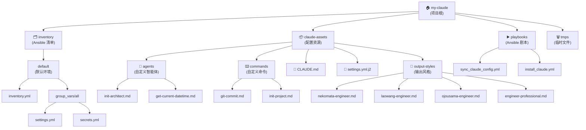

# my-claude-ansible

> **Claude Code 配置管理仓库** - 基于 Ansible 的声明式配置管理，实现 Claude 个性化配置的自动化部署与同步

---

## 📋 目录

- [项目愿景](#项目愿景)
- [架构总览](#架构总览)
- [模块结构图](#模块结构图)
- [模块索引](#模块索引)
- [快速开始](#快速开始)
- [运行与开发](#运行与开发)
- [全局开发规范](#全局开发规范)
- [AI 使用指引](#ai-使用指引)
- [变更记录](#变更记录)

---

## 项目愿景

**my-claude-ansible** 旨在提供一个可重复、可版本控制的 Claude Code 配置管理解决方案，通过 Ansible 的基础设施即代码（IaC）理念，实现：

- **声明式配置管理**：使用 YAML 声明期望状态，由 Ansible 自动执行到位
- **个性化输出风格**：支持多种人格化输出风格（猫娘工程师、大小姐工程师、老王工程师等）
- **自定义命令扩展**：通过 Markdown 定义 Claude 自定义命令（如 git-commit、init-project）
- **模型配置灵活性**：支持多层级模型配置（Opus、Sonnet、Haiku、子代理模型）
- **跨环境一致性**：确保开发、测试、生产环境的 Claude 配置一致

---

## 架构总览

本项目采用标准的 Ansible 项目结构，核心组件包括：

```text
my-claude/
├── claude-assets/        # Claude 配置资源（源文件）
│   ├── agents/          # 自定义智能体定义
│   ├── commands/        # 自定义命令定义
│   ├── output-styles/   # 输出风格定义
│   ├── CLAUDE.md        # 全局指令文档
│   └── settings.yml.j2  # settings.json 的 Jinja2 模板
├── inventory/           # Ansible 清单与变量
│   └── default/
│       ├── inventory.yml         # 主机清单
│       └── group_vars/all/
│           ├── settings.yml      # 公开配置变量
│           └── secrets.yml       # 敏感配置（API Key 等）
├── playbooks/           # Ansible Playbook
│   ├── sync_claude_config.yml   # 同步配置到 ~/.claude
│   └── install_claude.yml       # 安装 Claude Code
├── ansible.cfg          # Ansible 全局配置
└── tmps/                # 临时文件与日志
    ├── ansible.log      # Ansible 执行日志
    └── facts/           # Facts 缓存目录
```

**工作流程**：

1. 在 `inventory/default/group_vars/all/settings.yml` 中声明配置变量
2. Ansible 读取变量并渲染 `claude-assets/settings.yml.j2` 模板
3. 将渲染结果转换为 JSON 格式输出到 `~/.claude/settings.json`
4. 使用 rsync 同步 `commands`、`output-styles`、`CLAUDE.md` 等资源文件到 `~/.claude/`

---

## 模块结构图



---

## 模块索引

| 模块路径 | 职责 | 关键文件 | 文档链接 |
| -------- | ---- | -------- | -------- |
| `claude-assets/` | Claude 配置资源仓库，包含模板、命令、智能体、输出风格定义 | `settings.yml.j2`, `CLAUDE.md` | [查看文档](./claude-assets/CLAUDE.md) |
| `claude-assets/commands/` | 自定义命令定义（Markdown 格式） | `git-commit.md`, `init-project.md` | [查看文档](./claude-assets/commands/CLAUDE.md) |
| `claude-assets/agents/` | 自定义智能体定义（子 Agent） | `init-architect.md`, `get-current-datetime.md` | [查看文档](./claude-assets/agents/CLAUDE.md) |
| `claude-assets/output-styles/` | 个性化输出风格定义（人格化） | `nekomata-engineer.md`, `laowang-engineer.md` 等 | [查看文档](./claude-assets/output-styles/CLAUDE.md) |
| `inventory/` | Ansible 清单与变量管理 | `inventory.yml`, `settings.yml`, `secrets.yml` | [查看文档](./inventory/CLAUDE.md) |
| `playbooks/` | Ansible Playbook 剧本 | `sync_claude_config.yml`, `install_claude.yml` | [查看文档](./playbooks/CLAUDE.md) |

---

## 快速开始

### 前置条件

- Python 3.8+
- Ansible 2.9+
- Claude Code CLI 已安装

### 初始化项目

```bash
# 1. 克隆仓库
git clone <仓库地址> my-claude
cd my-claude

# 2. 创建 Python 虚拟环境（可选）
python3 -m venv .venv
source .venv/bin/activate

# 3. 安装 Ansible
pip install ansible

# 4. 配置变量
# 编辑 inventory/default/group_vars/all/settings.yml（公开配置）
# 编辑 inventory/default/group_vars/all/secrets.yml（敏感信息）

# 5. 同步配置到 ~/.claude
ansible-playbook playbooks/sync_claude_config.yml
```

### 验证配置

```bash
# 检查 settings.json 是否正确生成
cat ~/.claude/settings.json | jq .

# 检查自定义命令是否同步
ls -la ~/.claude/commands/

# 检查输出风格是否同步
ls -la ~/.claude/output-styles/
```

---

## 运行与开发

### 主要命令

```bash
# 同步配置到 ~/.claude（常用）
ansible-playbook playbooks/sync_claude_config.yml

# 查看配置变量（不执行）
ansible-playbook playbooks/sync_claude_config.yml --check --diff

# 安装 Claude Code（可选）
ansible-playbook playbooks/install_claude.yml

# 验证 Ansible 配置
ansible-config dump --only-changed

# 查看 Ansible 日志
tail -f tmps/ansible.log
```

### 修改配置流程

1. **修改变量**：编辑 `inventory/default/group_vars/all/settings.yml`
2. **测试渲染**：运行 `ansible-playbook playbooks/sync_claude_config.yml --check --diff`
3. **执行同步**：运行 `ansible-playbook playbooks/sync_claude_config.yml`
4. **验证结果**：检查 `~/.claude/settings.json` 和相关文件

### 添加新的输出风格

1. 在 `claude-assets/output-styles/` 创建新的 `.md` 文件
2. 编写人格化指令（参考现有风格文件）
3. 运行同步命令：`ansible-playbook playbooks/sync_claude_config.yml`
4. 在 `settings.yml` 中修改 `outputStyle` 为新风格的文件名（不含 .md）

### 添加新的自定义命令

1. 在 `claude-assets/commands/mc/` 创建新的 `.md` 文件
2. 按照 Claude 命令规范编写 front-matter 和指令内容
3. 运行同步命令：`ansible-playbook playbooks/sync_claude_config.yml`
4. 使用命令：`/your-command-name`

---

## 全局开发规范

### 代码风格

- **YAML 格式**：使用 2 空格缩进，键值对使用 `key: value` 格式
- **Jinja2 模板**：变量使用 `{{ variable }}` 格式，清晰注释变量来源
- **Markdown 文档**：遵循 CommonMark 规范，使用中文标点符号

### 文件命名约定

- **Playbook**：使用 `snake_case.yml` 命名（如 `sync_claude_config.yml`）
- **变量文件**：使用 `snake_case.yml` 命名（如 `settings.yml`）
- **自定义命令**：使用 `kebab-case.md` 命名（如 `git-commit.md`）
- **输出风格**：使用 `kebab-case.md` 命名（如 `nekomata-engineer.md`）

### 变量管理规范

- **公开配置**：放在 `settings.yml`（模型名称、API Base URL、输出风格等）
- **敏感信息**：放在 `secrets.yml`（API Key、密码等），并添加到 `.gitignore`
- **变量命名**：使用 `settings.` 前缀表示公开配置，`secrets.` 前缀表示敏感信息

### Git 提交规范

遵循 Conventional Commits 规范：

- `feat(scope): 新增功能`
- `fix(scope): 修复缺陷`
- `docs(scope): 文档更新`
- `refactor(scope): 代码重构`
- `chore(scope): 杂务维护`

---

## AI 使用指引

### 自定义命令

本项目提供以下自定义命令：

- `/git-commit [--emoji] [--no-verify]`：智能分析 Git 改动并生成 Conventional Commits 风格的提交信息
- `/init-project <项目摘要>`：初始化项目 AI 上下文，生成根级与模块级 CLAUDE.md 索引

### 自定义智能体

- **init-architect**：自适应初始化项目架构文档，支持分阶段扫描与增量更新
- **get-current-datetime**：获取当前时间戳（用于文档生成）

### 输出风格

可在 `settings.yml` 中切换以下输出风格：

- `engineer-professional`：专业工程师风格（标准、简洁）
- `nekomata-engineer`：猫娘工程师风格（可爱、活泼）
- `ojousama-engineer`：大小姐工程师风格（优雅、礼貌）
- `laowang-engineer`：老王工程师风格（幽默、接地气）

修改后运行 `ansible-playbook playbooks/sync_claude_config.yml` 生效。

### 模型配置

在 `settings.yml` 中配置多层级模型：

```yaml
settings:
  env:
    ANTHROPIC_DEFAULT_OPUS_MODEL: "claude-4.6-opus"      # 用于 Opus 或计划模式
    ANTHROPIC_DEFAULT_SONNET_MODEL: "claude-4.5-sonnet"  # 用于 Sonnet（默认）
    ANTHROPIC_DEFAULT_HAIKU_MODEL: "claude-4.6-haiku"    # 用于后台功能
    CLAUDE_CODE_SUBAGENT_MODEL: "claude-4.5-sonnet"      # 用于子代理
```

---

## 变更记录

### 2026-02-17

- **feat(docs)**: 初始化完整 AI 上下文文档（根级 CLAUDE.md）
- **feat(docs)**: 新增 Mermaid 模块结构图，可视化项目架构
- **feat(docs)**: 新增模块索引表格，清晰列出各模块职责与文档链接

### 2026-02-12

- **feat(docs)**: 新增 Claude 全局指令文档和 git-commit 命令
- **feat(playbook)**: 新增同步 commands 目录和 CLAUDE.md 文件的任务

### 2026-02-11

- **refactor(config)**: 细化模型配置结构，将单一模型配置拆分为多层级模型
- **fix(settings.yml)**: 注释原 outputStyle 配置，将其值从 "nekomata-engineer" 更新为 "laowang-engineer"

### 2026-02-10

- **fix(ansible.cfg)**: 移除 Ansible 弃用警告配置项
- **feat(settings.yml)**: 更新 outputStyle 配置为 "nekomata-engineer"
- **feat**: 创建 playbooks/sync_claude_config.yml 用于渲染和同步 claude 配置文件

---

## 许可证

待定

---

**最后更新时间**: 2026-02-17T05:32:00+00:00
