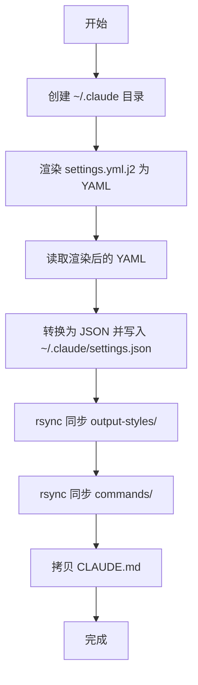

# playbooks 模块

[根目录](../CLAUDE.md) > **playbooks**

---

> **Ansible Playbook 剧本** - 自动化任务的执行脚本，负责同步配置和安装 Claude Code

---

## 📋 目录

- [模块职责](#模块职责)
- [目录结构](#目录结构)
- [关键文件说明](#关键文件说明)
- [使用方法](#使用方法)
- [开发指南](#开发指南)
- [常见问题](#常见问题)

---

## 模块职责

`playbooks/` 目录负责管理 Ansible Playbook，提供：

1. **配置同步**：将 `claude-assets/` 中的配置资源同步到 `~/.claude/`
2. **模板渲染**：使用 Jinja2 渲染 `settings.yml.j2`，生成 `settings.json`
3. **文件同步**：使用 rsync 同步 `commands`、`output-styles`、`CLAUDE.md` 等资源
4. **软件安装**：自动安装 Claude Code CLI（可选）

**核心理念**：

- **幂等性**：多次执行 Playbook 结果一致，不产生副作用
- **原子性**：任何任务失败时立即终止（`any_errors_fatal: True`）
- **可重复性**：确保配置同步过程可重复执行

---

## 目录结构

```text
playbooks/
├── sync_claude_config.yml         # 同步 Claude 配置到 ~/.claude
└── install_claude.yml             # 安装 Claude Code CLI（可选）
```

---

## 关键文件说明

### 1. `sync_claude_config.yml`

**用途**：将 `claude-assets/` 中的配置资源同步到 `~/.claude/` 目录。

**执行流程**：



**任务详解**：

#### 任务 1：创建 `~/.claude` 目录

```yaml
- name: 创建 ~/.claude 目录（如不存在）
  file: { path: "~/.claude", state: directory, mode: "0755" }
```

- **作用**：确保目标目录存在
- **幂等性**：如果目录已存在，不执行任何操作

---

#### 任务 2：渲染 `settings.yml.j2`

```yaml
- name: 渲染 claude settings.yml
  template:
    src: "{{ playbook_dir }}/../claude-assets/settings.yml.j2"
    dest: "/tmp/claude_settings.yml"
    mode: "0644"
```

- **作用**：使用 Jinja2 引擎渲染模板，将变量替换为实际值
- **输出**：临时 YAML 文件（`/tmp/claude_settings.yml`）
- **变量来源**：`inventory/default/group_vars/all/settings.yml` 和 `secrets.yml`

---

#### 任务 3：读取渲染后的 YAML

```yaml
- name: 读取渲染后的 YAML
  slurp:
    src: "/tmp/claude_settings.yml"
  register: settings_yml_content
```

- **作用**：读取临时 YAML 文件内容（Base64 编码）
- **输出**：存储在 `settings_yml_content` 变量中

---

#### 任务 4：转换为 JSON

```yaml
- name: 解析 YAML 并转为 JSON
  copy:
    dest: "~/.claude/settings.json"
    content: >-
      {{ settings_yml_content.content | b64decode
      | from_yaml | to_nice_json }}
    mode: "0644"
```

- **作用**：将 YAML 格式转换为 JSON 格式，写入 `~/.claude/settings.json`
- **处理流程**：
  1. `b64decode`：Base64 解码
  2. `from_yaml`：解析 YAML
  3. `to_nice_json`：转换为格式化的 JSON

---

#### 任务 5：同步 `output-styles/`

```yaml
- name: rsync 同步 output-styles 目录
  synchronize:
    src: "{{ playbook_dir }}/../claude-assets/output-styles/"
    dest: "~/.claude/output-styles/"
    recursive: yes
    mode: push
    delete: no
```

- **作用**：使用 rsync 同步输出风格文件
- **参数说明**：
  - `recursive: yes`：递归同步子目录
  - `mode: push`：从源推送到目标
  - `delete: no`：不删除目标中的额外文件

---

#### 任务 6：同步 `commands/`

```yaml
- name: rsync 同步 commands 目录
  synchronize:
    src: "{{ playbook_dir }}/../claude-assets/commands/"
    dest: "~/.claude/commands/"
    recursive: yes
    mode: push
    delete: no
```

- **作用**：使用 rsync 同步自定义命令文件
- **参数说明**：同任务 5

---

#### 任务 7：拷贝 `CLAUDE.md`

```yaml
- name: 拷贝 CLAUDE.md 文件
  copy:
    dest: "~/.claude/CLAUDE.md"
    src: "{{ playbook_dir }}/../claude-assets/CLAUDE.md"
    mode: "0644"
```

- **作用**：拷贝全局指令文档到 `~/.claude/CLAUDE.md`
- **用途**：定义 Claude 的全局行为规则

---

### 2. `install_claude.yml`

**用途**：自动安装 Claude Code CLI（具体实现待补充）。

**预期功能**：

- 检测操作系统与架构
- 下载 Claude Code CLI 安装包
- 执行安装脚本
- 验证安装成功

**当前状态**：文件存在但内容待完善。

---

## 使用方法

### 同步配置

**基本用法**：

```bash
ansible-playbook playbooks/sync_claude_config.yml
```

**检查模式（不执行，仅显示变更）**：

```bash
ansible-playbook playbooks/sync_claude_config.yml --check --diff
```

**指定环境**：

```bash
ansible-playbook -i inventory/prod/inventory.yml playbooks/sync_claude_config.yml
```

**详细输出**：

```bash
ansible-playbook playbooks/sync_claude_config.yml -v   # 详细模式
ansible-playbook playbooks/sync_claude_config.yml -vv  # 更详细模式
ansible-playbook playbooks/sync_claude_config.yml -vvv # 调试模式
```

---

### 验证同步结果

**检查 `settings.json`**：

```bash
cat ~/.claude/settings.json | jq .
```

**检查自定义命令**：

```bash
ls -la ~/.claude/commands/mc/
```

**检查输出风格**：

```bash
ls -la ~/.claude/output-styles/
```

**检查全局指令**：

```bash
cat ~/.claude/CLAUDE.md
```

---

### 查看执行日志

Ansible 执行日志存储在 `tmps/ansible.log`：

```bash
tail -f tmps/ansible.log
```

---

## 开发指南

### Playbook 结构

**标准结构**：

```yaml
---
- name: Playbook 描述
  hosts: localhost                 # 目标主机
  gather_facts: false              # 是否收集主机信息
  tasks:
    - name: 任务 1 描述
      module_name:
        param1: value1
        param2: value2

    - name: 任务 2 描述
      module_name:
        param1: value1
```

---

### 常用 Ansible 模块

#### 1. `file` 模块

**用途**：创建目录、文件、链接

**示例**：

```yaml
- name: 创建目录
  file:
    path: "~/.claude"
    state: directory
    mode: "0755"
```

---

#### 2. `template` 模块

**用途**：渲染 Jinja2 模板

**示例**：

```yaml
- name: 渲染模板
  template:
    src: "template.j2"
    dest: "/path/to/output"
    mode: "0644"
```

---

#### 3. `copy` 模块

**用途**：拷贝文件

**示例**：

```yaml
- name: 拷贝文件
  copy:
    src: "source.txt"
    dest: "/path/to/dest.txt"
    mode: "0644"
```

---

#### 4. `synchronize` 模块

**用途**：使用 rsync 同步目录

**示例**：

```yaml
- name: 同步目录
  synchronize:
    src: "source/"
    dest: "/path/to/dest/"
    recursive: yes
    delete: no
```

---

#### 5. `slurp` 模块

**用途**：读取文件内容（Base64 编码）

**示例**：

```yaml
- name: 读取文件
  slurp:
    src: "/path/to/file"
  register: file_content
```

---

### 添加新任务

**步骤 1**：在 Playbook 中添加任务

```yaml
- name: 我的新任务
  copy:
    src: "{{ playbook_dir }}/../source.txt"
    dest: "~/.claude/dest.txt"
    mode: "0644"
```

**步骤 2**：测试任务

```bash
ansible-playbook playbooks/sync_claude_config.yml --check --diff
```

**步骤 3**：执行任务

```bash
ansible-playbook playbooks/sync_claude_config.yml
```

---

### 调试 Playbook

**方法 1**：使用 `debug` 模块

```yaml
- name: 打印变量
  debug:
    msg: "Base URL: {{ settings.env.ANTHROPIC_BASE_URL }}"
```

**方法 2**：使用 `-vvv` 参数

```bash
ansible-playbook playbooks/sync_claude_config.yml -vvv
```

**方法 3**：查看日志文件

```bash
tail -f tmps/ansible.log
```

---

### 最佳实践

1. **任务命名清晰**：使用描述性的任务名称（中文）
2. **幂等性设计**：确保多次执行结果一致
3. **错误处理**：使用 `any_errors_fatal: True` 快速失败
4. **参数化路径**：使用 `{{ playbook_dir }}` 引用相对路径
5. **分步验证**：使用 `--check --diff` 预览变更

---

## 常见问题

### Q1：Playbook 执行失败？

**原因**：可能是文件路径错误或权限不足

**解决方法**：

```bash
# 1. 检查文件路径是否正确
ls claude-assets/settings.yml.j2

# 2. 检查目录权限
ls -la ~/.claude/

# 3. 使用详细模式查看错误
ansible-playbook playbooks/sync_claude_config.yml -vvv
```

---

### Q2：模板渲染失败？

**原因**：可能是变量未定义或 Jinja2 语法错误

**解决方法**：

```bash
# 1. 检查变量是否定义
ansible-inventory --list | jq .

# 2. 手动测试模板渲染
ansible localhost -m template -a "src=claude-assets/settings.yml.j2 dest=/tmp/test.yml"

# 3. 检查 Jinja2 语法
cat claude-assets/settings.yml.j2
```

---

### Q3：rsync 同步失败？

**原因**：可能是 rsync 未安装或路径错误

**解决方法**：

```bash
# 1. 检查 rsync 是否安装
which rsync

# 2. 手动测试 rsync
rsync -av claude-assets/commands/ ~/.claude/commands/

# 3. 检查源路径是否存在
ls claude-assets/commands/
```

---

### Q4：如何跳过某个任务？

**方法 1**：使用 `tags`

```yaml
- name: 跳过的任务
  copy:
    src: "source.txt"
    dest: "dest.txt"
  tags:
    - skip
```

```bash
ansible-playbook playbooks/sync_claude_config.yml --skip-tags skip
```

**方法 2**：使用 `when` 条件

```yaml
- name: 条件任务
  copy:
    src: "source.txt"
    dest: "dest.txt"
  when: run_this_task | default(false)
```

---

### Q5：如何加速 Playbook 执行？

**方法 1**：禁用 Facts 收集

```yaml
gather_facts: false  # 已在 sync_claude_config.yml 中配置
```

**方法 2**：增加并发数

```bash
# 编辑 ansible.cfg
[defaults]
forks = 20  # 已配置
```

**方法 3**：使用本地连接

```yaml
hosts: localhost
connection: local  # 已在 inventory.yml 中配置
```

---

**最后更新时间**: 2026-02-17T05:32:00+00:00
